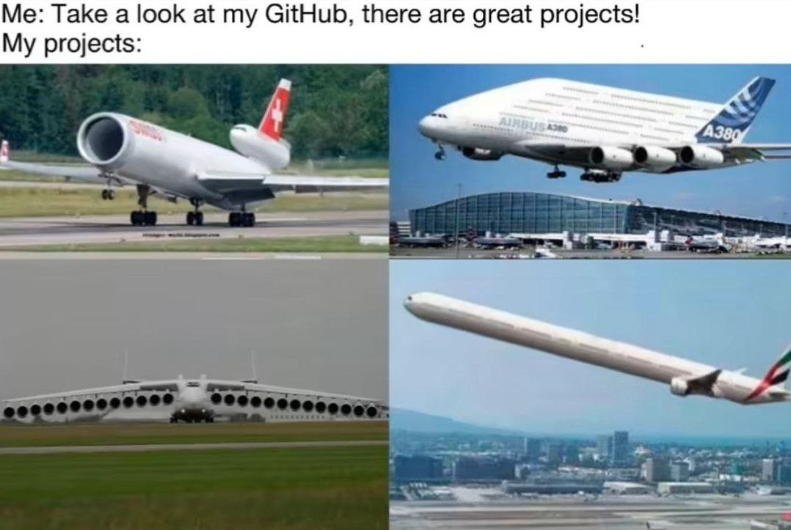

### Hi there 👋

Passionate AI enthusiast with an MSc in Artificial Intelligence from Tehran University, currently working as a Computer Vision Engineer. I specialize in developing cutting-edge vision models and have a strong interest in research on vision-language models and explainability. I thrive on solving complex problems and aim to make AI models more interpretable and impactful.
Seeking for collaboration in such fields, feel free to reach out to me via <a href="mailto:farshads7778@gmail.com?subject=intention of cooperation from [name]-[title]-[institute]">Email</a>

  

